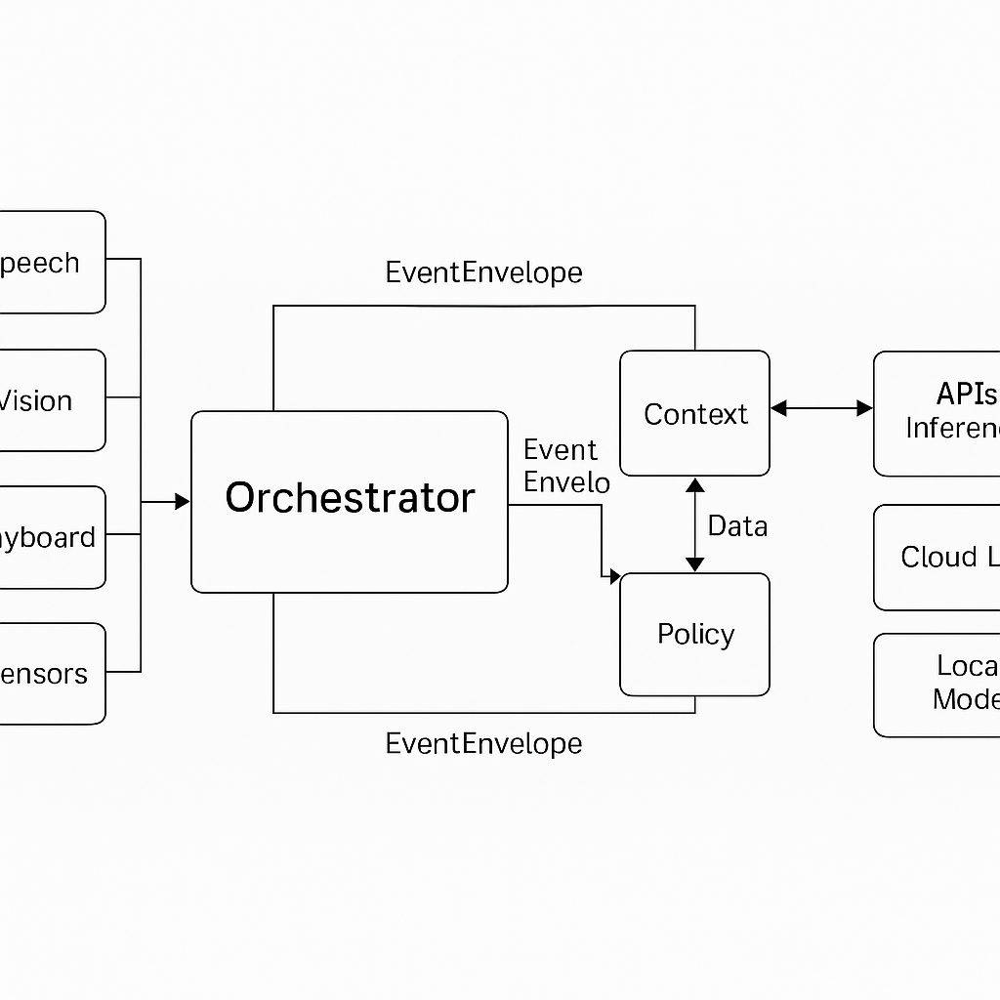

# Project Unison – System Architecture

## Overview
Project Unison is structured as a **modular, service‑oriented computing platform** designed for real‑time generation and orchestration of user experiences.  
Each subsystem is independently containerized, communicating through defined interfaces to ensure scalability, security, and future extensibility.

*Alt text: Grayscale architecture diagram showing user input and output modules (speech, vision, keyboard, sensors) connected to the core Unison services layer (orchestrator, context, storage, policy). 
Below the core layer, the diagram depicts external APIs and inference engines including cloud LLMs, local AI accelerators, and payment gateways. 
Arrows indicate bidirectional data flow using standardized EventEnvelope messages.*

## Architectural Layers

### 1. Input / Output Layer
- **Purpose:** Capture and render multimodal interaction.  
- **Components:**  
  - **Speech I/O:** voice recognition, text‑to‑speech, conversation.  
  - **Vision I/O:** image capture, object recognition, scene description.  
  - **Haptic and Sensor I/O:** gesture detection, environmental sensors, mobility interfaces.  
  - **Keyboard / Assistive Devices:** fallback and accessibility interaction paths.

### 2. Core Services Layer
These services form the runtime core that generates and mediates user experiences.

| Service | Function |
|----------|-----------|
| **Orchestrator** | Central coordination engine. Routes EventEnvelope requests, manages lifecycle, and enforces readiness of all subsystems. |
| **Context** | Maintains short‑term and long‑term memory for each user, providing personalization and continuity across sessions. |
| **Storage** | Handles persistent data and encrypted local partitions. Supports long‑term memory, cache, and structured logging. |
| **Policy** | Applies safety, consent, and compliance checks before any high‑impact action. Produces allow/deny/confirm responses. |

### 3. External Services & Inference Layer
- **Cloud APIs:** Large‑language models, knowledge bases, or third‑party data services.  
- **Local Inference Engines:** On‑device accelerators such as NPUs or GPUs for private, low‑latency computation.  
- **Transaction & Trust Services:** Payment APIs, secure identity verification, audit logging.

## Data Flow – The EventEnvelope Model
All components communicate through standardized **EventEnvelope** objects defined in `unison-spec`.  
An EventEnvelope includes:  
- `timestamp` – ISO 8601 time the event occurred  
- `source` – which module or agent emitted the event  
- `intent` – desired action or outcome  
- `payload` – structured data relevant to the intent  
- optional `auth_scope` and `safety_context` for policy evaluation

### Flow Sequence
1. An I/O module captures a user action or system trigger and emits an EventEnvelope.  
2. The **Orchestrator** receives it, validates structure, and queries **Policy** for authorization.  
3. If approved, the Orchestrator requests relevant **Context** and **Storage** data.  
4. The Orchestrator then calls the appropriate skill or generator—local or cloud—to fulfill the intent.  
5. The generated output (text, media, action) is returned through the originating I/O channel.  
6. The **Context** module updates user state for continuity in future interactions.

## Design Principles
- **Modularity:** Each service can be replaced or scaled independently.  
- **Interoperability:** Uses open schemas (JSON, MCP‑compatible agent protocols).  
- **Security & Privacy:** User data is partitioned; sensitive operations require explicit policy approval.  
- **Extensibility:** New I/O agents or inference engines can attach without changing core logic.  
- **Transparency:** All inter‑service communication is logged and auditable.
  **Self-Introspection:**
Every Unison instance maintains a registry of its I/O capabilities, connected components, and available inference engines. This allows the system to explain its own configuration conversationally and assist people in extending or troubleshooting it.

## Summary
Project Unison provides the architectural foundation for context‑aware, generative computing.  
By combining modular orchestration, policy‑gated trust, and standardized event flow, it enables devices to generate personalized experiences on demand—securely, privately, and in real time.
