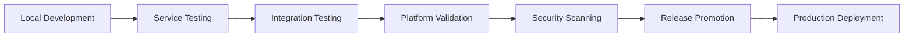

# Platform Development Workflow

> **Learn how to develop, test, and deploy services on the Unison Platform with our streamlined workflow.**

## 🔄 Development Lifecycle

The Unison Platform provides a unified development experience while maintaining service autonomy. Here's the complete workflow from idea to production:



---

## 🛠️ Local Development

### **1. Platform Setup**

```bash
# Clone and start the platform
git clone https://github.com/project-unisonos/unison-platform.git
cd unison-platform
make dev
```

This starts:
- ✅ All 15+ services with hot reload
- ✅ Development tools and debugging
- ✅ Comprehensive logging and monitoring
- ✅ Local testing environment

### **2. Service Development**

For individual service development:

```bash
# Navigate to your service repository
cd ../unison-intent-graph

# Link with platform for local development
make dev-local

# Run service-specific tests
make test-unit

# Start service with platform dependencies
make dev-with-platform
```

### **3. Development Tools**

```bash
# View logs from all services
make logs

# Follow logs for specific service
make logs-service SERVICE=intent-graph

# Get shell in service container
make shell SERVICE=context-graph

# Execute commands in service
make exec SERVICE=orchestrator CMD="env | grep SERVICE"
```

---

## 🧪 Testing Strategy

### **Unit Testing**

Each service includes comprehensive unit tests:

```bash
# Run unit tests for a service
cd ../unison-intent-graph
make test-unit

# Run with coverage
make test-unit-coverage

# Run specific test file
make test-unit TEST_FILE=test_intent_processing.py
```

### **Integration Testing**

Platform-level integration tests verify service interactions:

```bash
# Run all integration tests
make test-int

# Run specific test suite
make test-int SUITE=intent_orchestration

# Run tests with observability
make test-int-observability
```

**Integration Test Coverage:**
- ✅ Intent processing workflows
- ✅ Context management and fusion
- ✅ Experience generation and adaptation
- ✅ Event-driven communication
- ✅ Service health and dependencies
- ✅ Error handling and recovery

### **Contract Testing**

Validate service contracts and API compliance:

```bash
# Validate all service contracts
make validate

# Validate specific service
make validate-service SERVICE=intent-graph

# Generate contract documentation
make docs-contracts
```

---

## 🔧 Platform Commands

### **Service Management**

```bash
# Start development environment
make dev

# Start with observability stack
make observability

# Restart specific service
make restart-service SERVICE=orchestrator

# Scale service instances
make scale-service SERVICE=intent-graph COUNT=3
```

### **Testing & Validation**

```bash
# Run complete test suite
make test-all

# Run integration tests only
make test-int

# Validate service contracts
make validate

# Run security scans
make security-scan
```

### **Build & Deployment**

```bash
# Build all services
make build

# Build specific service
make build-service SERVICE=intent-graph

# Pin exact image versions
make pin

# Deploy to staging
make deploy-staging

# Deploy to production
make deploy-prod
```

---

## 📋 Service Integration

### **1. Adding a New Service**

When creating a new service for the platform:

```bash
# 1. Create service repository
git clone https://github.com/project-unisonos/service-template.git my-new-service
cd my-new-service

# 2. Implement platform contracts
# - ServiceContract base class
# - EventEnvelope handling
# - Health endpoints
# - OpenTelemetry instrumentation

# 3. Add platform CI/CD workflow
# Copy .github/workflows/ci.yml from platform template

# 4. Update platform compose file
# Add service configuration to unison-platform/compose/compose.yaml

# 5. Add integration tests
# Create tests in unison-platform/tests/integration/
```

### **2. Service Contract Implementation**

```python
# src/contracts.py
from unison_spec.contracts import ServiceContract, HealthResponse
from unison_spec.events import EventEnvelope, EventType

class MyServiceContract(ServiceContract):
    async def health(self) -> HealthResponse:
        """Return service health status"""
        return HealthResponse(
            status="healthy",
            service="my-service",
            version="1.0.0"
        )
    
    async def handle_event(self, envelope: EventEnvelope) -> EventEnvelope:
        """Handle incoming events"""
        if envelope.event_type == EventType.MY_EVENT:
            # Process event and return response
            return self.create_response_event(envelope)
        return None
    
    def get_service_info(self):
        """Return service metadata"""
        return ServiceInfo(
            name="my-service",
            version="1.0.0",
            domain="skills",
            capabilities=["my_capability"],
            endpoints=["/health", "/process"]
        )
```

### **3. Event Handling**

```python
# src/events.py
from unison_spec.events import EventEnvelope, EventType, MyServiceEvent

class EventHandler:
    async def handle_my_event(self, event: MyServiceEvent):
        """Handle service-specific events"""
        try:
            # Process the event
            result = await self.process_event(event)
            
            # Create response event
            response = EventEnvelope(
                event_type=EventType.MY_RESPONSE,
                source_service="my-service",
                correlation_id=event.correlation_id,
                data={"result": result}
            )
            
            return response
            
        except Exception as e:
            # Create error event
            error_event = EventEnvelope(
                event_type=EventType.PROCESSING_ERROR,
                source_service="my-service",
                correlation_id=event.correlation_id,
                data={"error": str(e)}
            )
            return error_event
```

---

## 🔒 Security & Compliance

### **Development Security**

```bash
# Run security scans during development
make security-scan

# Check for vulnerabilities
make vulnerability-check

# Validate security policies
make security-validate

# Generate SBOM
make sbom-generate
```

### **Code Quality**

```bash
# Run code quality checks
make quality-check

# Format code
make format

# Lint code
make lint

# Type checking
make type-check
```

---

## 📊 Observability & Debugging

### **Local Observability**

```bash
# Start with full observability stack
make observability

# Access monitoring tools
# Jaeger: http://localhost:16686
# Prometheus: http://localhost:9090
# Grafana: http://localhost:3000
```

### **Debugging Tools**

```bash
# Enable debug logging
make debug-enable

# View service metrics
make metrics SERVICE=intent-graph

# Trace request flow
make trace REQUEST_ID="request-123"

# Profile service performance
make profile SERVICE=context-graph
```

### **Log Analysis**

```bash
# Search logs across all services
make logs-search QUERY="error"

# Analyze error patterns
make logs-analyze SERVICE=orchestrator LEVEL=error

# Export logs for analysis
make logs-export SERVICE=intent-graph SINCE="1h"
```

---

## 🚀 Release Process

### **1. Service Release**

Each service follows the automated release process:

```bash
# Service repository
cd ../unison-intent-graph

# Create release (automated via CI/CD)
git tag v1.2.3
git push origin v1.2.3

# CI/CD automatically:
# - Builds multi-platform images
# - Runs security scans
# - Generates SBOM
# - Creates provenance attestations
# - Promotes to registry
```

### **2. Platform Release**

Platform releases coordinate multiple services:

```bash
# Platform repository
cd unison-platform

# Pin exact versions for reproducible deployment
make pin

# This creates:
# - compose.pinned.yaml with exact image digests
# - artifacts.lock with version information
# - release bundle with SBOM and provenance
```

### **3. Version Management**

```bash
# List current versions
make version-list

# Check for updates
make version-check

# Update to latest versions
make version-update

# Validate version compatibility
make version-validate
```

---

## 🔄 Continuous Integration

### **Service CI/CD Workflow**

Each service uses the universal platform workflow:

```yaml
# .github/workflows/ci.yml
name: ci
on: [push, pull_request]
jobs:
  build:
    uses: project-unisonos/unison-platform/.github/workflows/reusable-build.yml@main
    with:
      image_name: unison-my-service
      domain: skills
      test_command: make test-unit
      validate_contracts: true
```

### **Platform Integration Tests**

```yaml
# unison-platform/.github/workflows/integration-tests.yml
name: integration-tests
on: [push, pull_request]
jobs:
  test:
    runs-on: ubuntu-latest
    steps:
      - uses: actions/checkout@v4
      - name: Start platform
        run: make up
      - name: Run integration tests
        run: make test-int
      - name: Validate contracts
        run: make validate
```

---

## 🛠️ Development Environment

### **IDE Configuration**

Recommended VS Code extensions for platform development:

```json
{
  "recommendations": [
    "ms-python.python",
    "ms-python.black-formatter",
    "ms-python.flake8",
    "ms-python.mypy-type-checker",
    "ms-vscode.docker",
    "github.vscode-pull-request-github",
    "redhat.vscode-yaml"
  ]
}
```

### **Development Scripts**

```bash
# scripts/dev-setup.sh
#!/bin/bash
# Setup development environment

echo "🚀 Setting up Unison Platform development environment..."

# Clone platform repository
git clone https://github.com/project-unisonos/unison-platform.git
cd unison-platform

# Setup environment
cp .env.template .env

# Start development environment
make dev

# Install development tools
pip install -r requirements-dev.txt

# Setup pre-commit hooks
pre-commit install

echo "✅ Development environment ready!"
echo "📋 Available commands: make help"
```

---

## 📚 Best Practices

### **Code Organization**

```
my-service/
├── src/
│   ├── main.py              # FastAPI application
│   ├── contracts.py         # Service contract implementation
│   ├── events.py           # Event handling logic
│   ├── models.py           # Pydantic models
│   └── utils.py            # Utility functions
├── tests/
│   ├── unit/               # Unit tests
│   ├── integration/        # Integration tests
│   └── fixtures/           # Test fixtures
├── Dockerfile              # Multi-stage build
├── requirements.txt        # Python dependencies
├── pyproject.toml         # Project configuration
└── README.md               # Service documentation
```

### **Development Guidelines**

1. **Always implement ServiceContract**: Ensure consistent interface
2. **Use EventEnvelope**: Standardize event communication
3. **Include health endpoints**: Enable platform monitoring
4. **Add OpenTelemetry**: Provide distributed tracing
5. **Write integration tests**: Verify service interactions
6. **Follow security practices**: Use platform security baselines
7. **Document APIs**: Use OpenAPI specifications

### **Testing Strategy**

1. **Unit Tests**: Test individual components
2. **Integration Tests**: Test service interactions
3. **Contract Tests**: Validate API compliance
4. **Security Tests**: Verify security controls
5. **Performance Tests**: Check resource usage
6. **End-to-End Tests**: Verify complete workflows

---

## 🎯 Next Steps

### **For New Developers**

1. **Read Platform Overview**: Understand architecture
2. **Complete Getting Started**: Set up development environment
3. **Explore Service Templates**: Use proven patterns
4. **Join Community**: Get help and contribute

### **For Service Integration**

1. **Implement Contracts**: Follow platform standards
2. **Add Integration Tests**: Verify compatibility
3. **Update CI/CD**: Use platform workflows
4. **Document APIs**: Provide clear specifications

### **For Platform Contributions**

1. **Read Contributing Guide**: Follow contribution process
2. **Create Issues**: Report bugs and request features
3. **Submit Pull Requests**: Contribute improvements
4. **Join Discussions**: Participate in planning

---

**🔗 Related Documentation**
- [Platform Overview](platform-overview.md)
- [Getting Started](getting-started.md)
- [API Reference](api-reference/README.md)
- [Deployment Guide](deployment/README.md)
- [Contributing Guide](../CONTRIBUTING.md)
